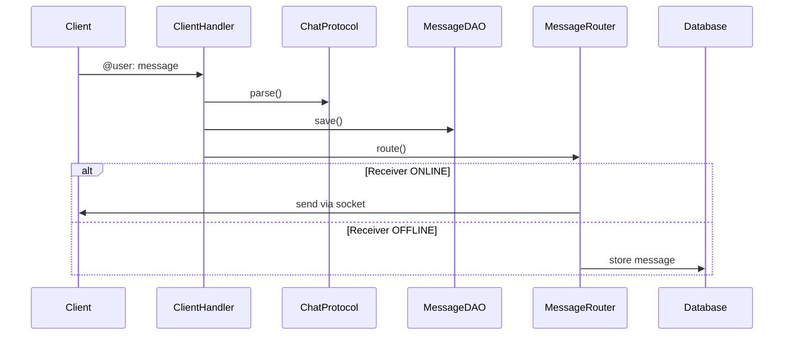

# Java Socket Chat Application

A simple real-time chat application built using Java socket programming and PostgreSQL.
It supports multiple users, online/offline status, and offline message delivery.

# Java Socket Chat Application

A simple real-time chat application built using **Java sockets** and **PostgreSQL**.
Supports multiple users, user status tracking, and offline message delivery.

---

## How the Application Works

### 1. Socket Connection Flow

1. `ChatServer` starts and listens on a TCP port
2. A `ChatClient` connects to the server using a socket
3. Server creates a new `ClientHandler` thread for that client
4. Server asks the client to enter a username
5. Username is stored in the database with status `ONLINE`
6. Client can now send and receive messages

---

## Message Input Format

To send a message, the client types:

@receiverUsername: message

### Example

@alice: Hello Alice!

---

## Message Flow

---

## Offline Message Handling

- Messages are **always saved to the database**
- If the receiver is offline, messages remain undelivered
- When the receiver reconnects:
    - Server fetches undelivered messages
    - Sends them to the user
    - Marks them as delivered

---

## User Status Handling

- On socket connection → status set to `ONLINE`
- On socket disconnection → status set to `OFFLINE`
- `lastSeen` timestamp updated on status change

---

## Architecture Overview

ChatClient
|
| Socket
v
ChatServer
|
+-- ClientHandler (per client)
|
+-- ChatProtocol
+-- MessageRouter
+-- UserDAO / MessageDAO
|
v
PostgreSQL

---

## Key Points

- One username per connection
- One thread per client
- Socket communication is real-time
- Database ensures reliability and offline delivery
- No Spring framework is used

---

## How to Run

1. Start PostgreSQL and create required tables
2. Run `ChatServer`
3. Run multiple `ChatClient` instances in separate terminals
4. Enter username and start chatting

---

## Summary

Sockets handle real-time communication.
The database stores users, statuses, and messages.
Offline users receive messages when they reconnect.
